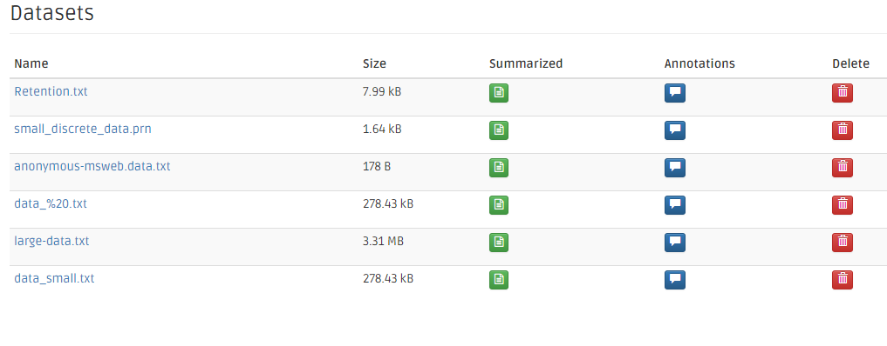
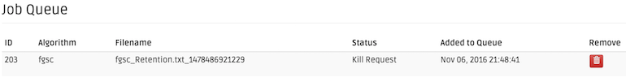
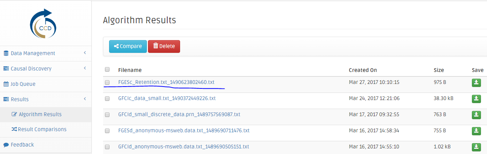

# Causal Web Application Quick Start and User Guide

## Creating Your Account

We are currently hosting an the Causal Web Application at the Pittsburgh Supercomputing Center. The url for the site is [https://ccd4.vm.bridges.psc.edu/ccd/](https://ccd4.vm.bridges.psc.edu/ccd/). And you can create new accoutn by clikcing "Create an account" on the login page.

Fill your information in the signup page. 
Make sure to read the **Terms & Conditions** agreement and check the agree box before clicking the green signup button.

The system will send an email with an activation link. After clicking on the link, the Causal Web system shows a confirmation message.

Click on the link in the email. Alternatively, click on the **"University"** button to login to the Causal Web via your Pitt/Harvard account.

## Login to Causal Web Application

Input your email address and password that you want to use to register with the Causal Web system. 
Check the Remember Me checkbox if you would like the browser automatically log you in next time you visit.

Here we go! You are now in the Causal Web application.

## Uploading Your Dataset

Click on the Data Management link on the navigation bar on the left side. There is a sub menu that will appear. Click on the Import Data link.

You can **EITHER** drag & drop dataset file(s) into the dash-surrounded canvas **OR** 
you can click on the **Browse** button and choose the dataset file(s) you would like to upload to the Causal Web application. For testing purposes download this dataset: [Retention.txt](http://www.ccd.pitt.edu/wp-content/uploads/files/Retention.txt) and upload it.

The **Import Data** panel shows the dataset upload progress as a percentage along with MD5 checksums (confirms that an uploaded file's contents are unchanged after upload) for each of uploaded files.

You can also pause the upload of files and resume later. In the case of a disrupted connection, you can resume the upload by repeating the previous steps. The Causal Web application will detect the unfinished upload and resume from the latest point of the last attempt.

Once all your dataset file(s) are all uploaded, the progress bar will show the **(completed)** sign.

## Summarizing Your Dataset

Before any analysis can proceed, the datasets need to be summarized. Specifically, you must indicate the delimiter used in the data file (tab vs. comma), and the types of variables found in the file. Once this is done, the Causal Web application will determine the number of columns (features) and rows (records) in the dataset. 

Click on the **Data Management** menu on the navigation bar on the left side. The sub menu will slowly appear. Click on the **Datasets** menu.

The dataset page shows a list of datasets and their attributes. On the second **Summarized** column from the right, the yellow warning buttons indicate that the system has not yet summarized.

Click on the dataset's name's link to see the dataset information. From this stage, the data summary information is missing: the dataset needs to be summarized before conducting causal analysis.

From the dataset page, click on the yellow warning button to summarize a dataset. The data summarization page shows information of the dataset, its basic information, and additional information that will be determined after summarization (a number of rows and columns). The bottom panel has two radio boxes for you to choose variable type (continuous or discrete), and delimiter (tab or comma). The Retention.txt dataset described above is tab-delimited and contains continous variables.

Once the dataset is summarized, the dataset page changes its sign to be a green button. Click to see the additional information of this summarized dataset.

Click on the dataset's name's link to see the additional information.

## Uploading the Prior Knowledge

Click on the **Data Management** menu on the navigation bar on the left side. There is a sub menu that will appear. 
Click on the **Import Data** menu.

You can EITHER drag & drop prior knowledge file(s) into the dash-surrounded canvas OR 
you can click on the Browse button and choose the prior knowledge file(s) you would like to upload to the CCD Web application. Note that the prior knowledge file needs to have *.prior* file extension.

## Executing an Analysis on Your Dataset

Click on the Causal Discovery menu on the navigation bar on the left side. The sub menu will slowly appear. 
Click on the desired algorithms. As of November 2016, **FGES** *(Continuous)*, **FGES Discrete**, and **GFCI** *(Continuous)* are the only supported algorithms.  Note that in previous versions of our software FGES was known as 

The **Dataset** drop-down box contains a list of datasets that the system recognize. If those datasets are already uploaded and they are not displayed in the dataset drop-down box, it means that the [Data Summarization](#summarization) process to be reviewed in the first place prior to execute a causal **FGES** *(Continuous)* analysis. 
If a prior knowledge file needs to be computed, Prior Knowledge File drop-down box contains a list of knowledge files. 
Before clicking the **Next** button, the data validation parameters need to be input.

Here, the **FGES** algorithm page allows user to modify its parameters. 

- The first one is Penalty Discount and its default value is 4. 
- The second one is Search Maximum Degree and its default value is 100. 
- The third one is Faithfulness Assumed and its default value is checked.
- The fifth one is Verbose output and its default value is checked.

Click **Next** to proceed or click Advanced Options (JVM) for the JVM customization.

**Expert Mode**: the JVM parameters allow users to customize JVM parameters such how much maximum memory (in Gigabyte scale) the process would allocate (e.g. 4).

This is the summary page before the FGES job analysis is put into the queue. 
Click on the number 1 (Select Dataset) or number 2 (Set Parameters) to go back to modify the parameters. 
Once, everything is set. Click the **Run Algorithm!** button.

The application will redirect the **Job Queue** page. The analysis job is added to the queue. The **Queued** status means that it waits for the scheduler to run it once the executing slot is available. However, the **Job Queue** page does not currently automatically update the jobs' status (at least in this development stage). Refresh the **Job Queue** page from time to time to see the latest jobs' status.

Once the job slot is available, the queued job is then executed and its status changes to **Running**.

When the job is finished, it is automatically removed from the **Job Queue** page. The result of the analysis is added to the Results page.

In case the **queued** or **running** job needs to be killed or removed, click the **Remove** button on the first column on the **Job Queue** page from the right. 
The **Remove Job** confirmation page is popped up. Click **Yes** to kill the job or **No** to cancel the kill operation.

After the job cancellation is confirmed, the job's status changes to **Kill Request**. The scheduler will take care of removing of the job from the queue or killing a job in the server.

If the running job was killed or any error happened during the process, the error result will appear in the **Results** page. Its background is highlighted in red.

If there is an error, you will see the details of the error by clicking on error result link.

## Reviewing Your Result

Click on the **Results** menu on the navigation bar on the left side. 
Click on the **Algorithm Results** menu.

The **Algorithm Results** page shows a list of results, their creation time and their size. On the first column from the right, the green **Save** buttons provide the ability for users to download results to their local computers. 
Click on the result's name's link to see a causal graph of the result.

Check the result files on their checkboxes to [compare the results](#comparing_result). 
**Note**: a number of comparing datasets can be more than two files.

The results page details the graph, the original dataset, and its parameters. 
Click on the **View Full Screen** button to see the causal graph in more detail.

The figure shows the causal graph in the full-screen mode.

## Comparing Your Result

Click on the **Results** menu on the navigation bar on the left side. To compare two results click on the Algorithm Results item on the left. Select at least two results (place a checkmark next to the results) and click on Compare. Now click on the **Result Comparisions** item on the left.

The Result Comparisons page shows a list of results, their creation time and their size. On the first column from the right, the green Save buttons provide the ability for users to download results to their local computers. Click on the result's name's the link to see the detail of the result comparisons.

The **Result Comparisons** page shows the datasets compared, and the table of edges, their mutual appearance in all comparing datasets, and their mutual endpoint types.

## Downloading Your Result And Comparision Result

On the first column from the right of the **Algorithm Results** page, the green **Save** buttons provide the ability for users to download results to their local computers.

On the first column from the right of the **Result Comparisions** page, the green **Save** buttons provide the ability for users to download result comparisons to their local computers.

## Submit Your Feedback

Click the **Feedback** menu on the navigation menu bar on the left. 
The **Feedback** page shows the email (optional), and the text area for the user feedback (required). 
Once, the feedback is filled, click the **Send Feedback** button.

The green **Thank you for you feedback!** banner shows that the feedback submitted successfully.

