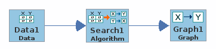

#Tetrad Express

## Description
A Cytoscape application (plugin) for running a simple causal model search.

## Purpose
Provide a basic user-friendly interface for running a simple search algorithm from Tetrad.

## Workflow
Below are the workflows you can peform:

### Workflow 1: Simple Search
This is the simplest workflow to run a simple search.  Figure 1 shows the same workflow in Tetrad.

 1. Import data.
 2. Select algorithm.
 3. Set algorithm parameters.
 4. Run search.
 5. Display graph.

|  |
|:--:|
| *Figure 1.* |

### Workflow 2: Add Knowledge
This workflow is to add additional knowledge to the dataset.  Figure 2 shows the same workflow in Tetrad.

1. Import data.
2. Select knowledge type.
    - Set knowledge.
3. Select algorithm.
4. Set algorithm parameters.
5. Run search.
6. Display graph.

|  |
|:--:|
| *Figure 2.* |

### Workflow 3: Apply Data Transformation
This workflow is to apply data transformation to the dataset.  Figure 3 shows the same workflow in Tetrad.

1. Import data.
2. Edit the data:
    - Select a data transformation.
3. Select algorithm.
4. Set algorithm parameters.
5. Run search.
6. Display graph.

|  |
|:--:|
| *Figure 3.* |
